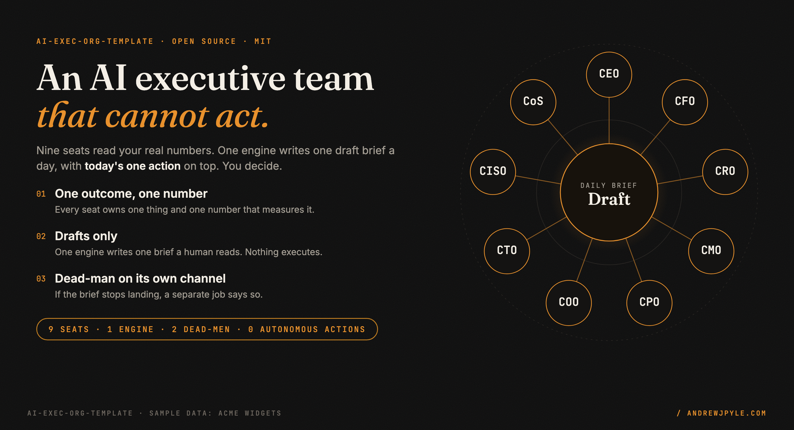
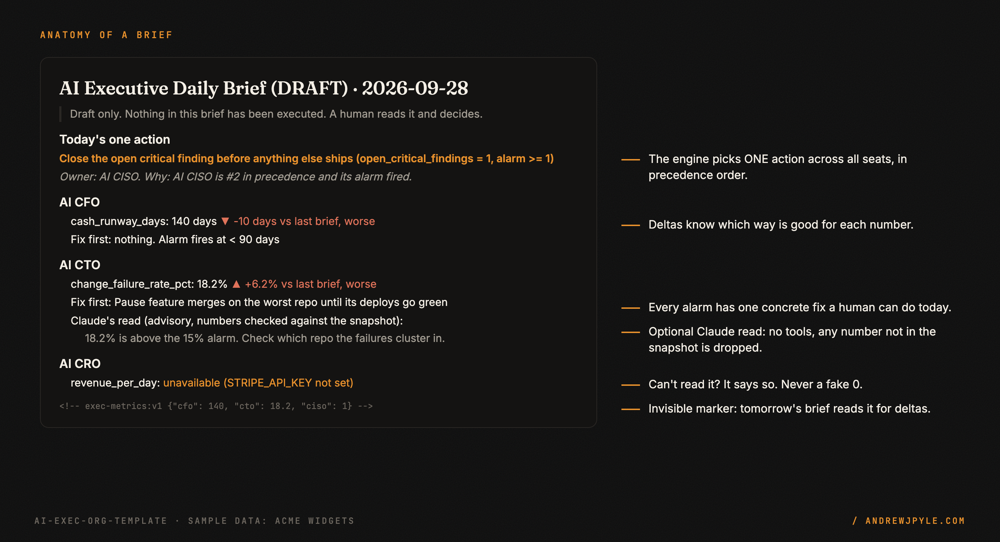
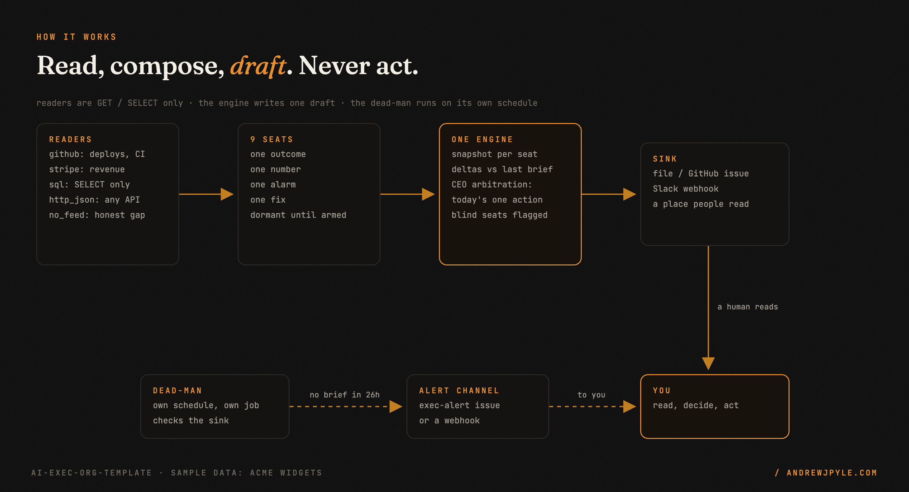
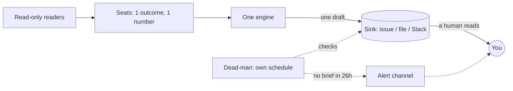
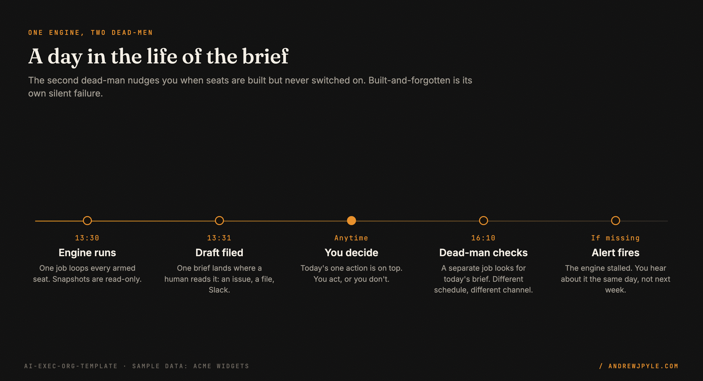
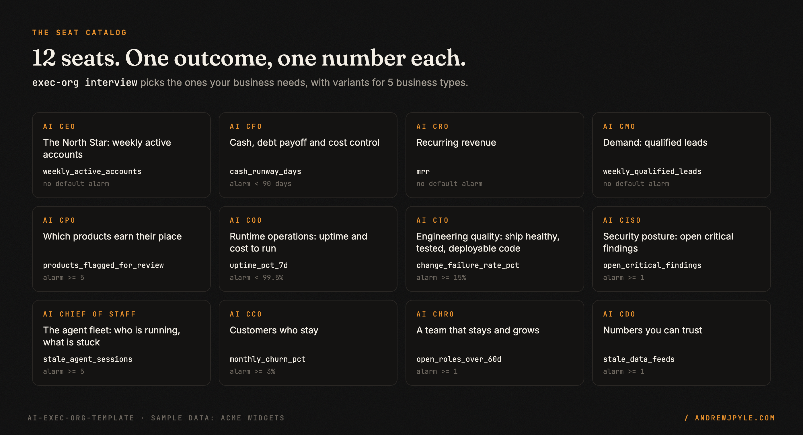

<p align="center">
  
</p>

<p align="center">
  <a href="https://github.com/andrewjpyle/ai-exec-org-template/actions/workflows/ci.yml"></a>
  
  
  
  <a href="https://github.com/andrewjpyle/ai-exec-org-template/issues?q=label%3Aexec-brief"></a>
</p>

# An AI executive team that cannot act

Most "AI agents for your business" pitches end with the agent doing things: sending the email,
moving the money, merging the PR. This is the other half, the half that makes the first half
safe: **AI executives that read your real numbers every day, tell you the one thing to fix first,
and cannot do anything else.**

- **Nine seats** (CEO, CFO, CRO, CMO, CPO, COO, CTO, CISO, Chief of Staff). Each owns **one outcome
  and one number**, with an alarm and one concrete fix.
- **One engine** writes **one draft brief** a day, with **today's one action** on top, picked by a
  strict precedence rule. Day-over-day deltas know which direction is good.
- **Two dead-man alarms** on a separate schedule and channel: one fires if the brief stops landing,
  the other if seats get built but never switched on.
- **Zero core dependencies.** Read-only connectors for GitHub, Stripe, SQL and any JSON API. An
  optional Claude layer that has no tools and cannot invent a number.

> **The one idea worth stealing, even if you never run this code:** give every AI exec one owned
> outcome and one number, not a job description. "Owns cash runway, in days" beats "helps with
> finance." If a seat cannot name the number it moves, it is not a seat yet.

---

## 60 seconds to a first brief

```bash
pip install "git+https://github.com/andrewjpyle/ai-exec-org-template@v0.2.0"
mkdir my-exec-org && cd my-exec-org
exec-org init                                 # roster, sample numbers, workflows, CLAUDE.md
exec-org seats                                # 9 seats, all dormant
EXEC_ARMED=cfo,cto,ciso exec-org brief --dry-run
```

You get a brief like this (from the sample data of a fictional company, Acme Widgets):

```markdown
## Today's one action

**Close the open critical finding before anything else ships (open_critical_findings = 1, alarm >= 1)**

_Owner: AI CISO. Why: AI CISO is #2 in precedence and its alarm fired._

## AI CTO
_Owns: Engineering quality: ship healthy, tested, deployable code_

- **change_failure_rate_pct**: 18.2% (no prior reading)
- Fix first: Pause feature merges on the worst repo until its deploys go green (change_failure_rate_pct = 18.2%, alarm >= 15%)
```

From the second brief on, every number shows its change and whether that is better or worse.
Full example with deltas: [`examples/briefs/acme_2026-09-28.md`](examples/briefs/acme_2026-09-28.md).

<p align="center"></p>

## From your real data in 10 minutes

Seats start by reading `metrics.json`. Swap each for a real, **read-only** reader in `exec_roles.py`:

```python
from exec_org.readers import github, stripe, sql, http_json, no_feed
from exec_org.registry import Seat, Threshold

Seat("cto", "AI CTO", owned_outcome="Engineering quality", number="change_failure_rate_pct",
     unit="%", better="down", alarm=Threshold(">=", 15),
     fix="Pause feature merges on the worst repo until its deploys go green",
     snapshot=github.change_failure_rate("your-org/your-app"))        # GitHub Deployments API

Seat("cro", "AI CRO", owned_outcome="Revenue per day", number="revenue_per_day",
     unit=" USD/day", alarm=Threshold("<", 2000), fix="Chase the three largest overdue invoices",
     snapshot=stripe.revenue_per_day(days=7))                         # restricted rk_ key only

Seat("cfo", "AI CFO", owned_outcome="Cash runway", number="cash_runway_days", unit=" days",
     alarm=Threshold("<", 90), fix="Cut or defer the largest non-payroll cost line",
     snapshot=sql("cash_runway_days", "SELECT runway_days FROM finance_summary", connect=my_readonly_conn))

Seat("ciso", "AI CISO", owned_outcome="Security posture", number="open_critical_findings",
     better="down", alarm=Threshold(">=", 1), fix="Close it before anything else ships",
     snapshot=no_feed("open_critical_findings", "no scanner wired yet"))   # says "not measured", never 0
```

| Reader | Reads | Guard |
|---|---|---|
| `github.change_failure_rate` | Deployments API, latest status per deploy | read-only token, pending deploys never counted |
| `github.ci_pass_rate` | Actions runs on a branch | read-only token |
| `stripe.revenue_per_day` | balance transactions, net of refunds | refuses `sk_` keys; restricted `rk_` only |
| `sql` | any DB-API connection or sqlite | a single `SELECT`, write keywords refused |
| `http_json` | any JSON API, dotted path | token from an env var you name |
| `no_feed` | nothing (yet) | shows **not measured**, never a 0 |

More: [`docs/CONNECTORS.md`](docs/CONNECTORS.md).

## How it works

<p align="center"></p>



1. **Snapshot.** Every armed seat runs its reader. A reader that fails returns
   `unavailable (why)`. It never raises into the brief and never guesses.
2. **Arbitrate.** Seats are checked in a precedence order you declare (cash, security and uptime
   first by default). The first seat whose alarm fires on a *readable* number sets **today's one
   action**. If nothing fired but some seats were unreadable, the brief says so: an all-clear over
   blind inputs is not an all-clear.
3. **Draft.** One markdown brief goes to a sink people read: a file, a GitHub issue, Slack. An
   invisible `exec-metrics:v1` marker at the bottom lets tomorrow's brief compute deltas.
4. **Watch the watcher.** The dead-man runs as a separate job, on a separate schedule, and alerts on
   a separate channel. An alarm must never share a queue with the thing it watches.

<p align="center"></p>

## Why "cannot act"

I run a portfolio of 100+ live sites with one operator and a fleet of Claude Code agents, and this
is a trimmed-down, dependency-free version of the executive layer I run on it. The rule there is
the rule here: **agents propose, a human decides.** Every production action goes through a person.

That rule was learned, not assumed. An autonomous trading bot I built lost real money before I
switched it off. The briefs are allowed to be wrong, because a person reads them. An actuator is not
allowed to be wrong.

The dead-man is in here for the same reason. On 2026-09-27 my own daily brief did not land. Nothing
crashed loudly; it simply was not there. The stall dead-man, which only watches the engine, caught
it that afternoon.

## Know which seats you need: the interview

```bash
exec-org interview                         # 8 questions
exec-org interview --from company.md       # or read a description of your company
exec-org interview --write                 # save exec_roles.py + metrics.json
exec-org interview --from company.md --claude   # optional: Claude polishes the wording
```

Your answers pick seats from a catalog of 12, with variants for SaaS, agencies, e-commerce,
content portfolios and services. It is deterministic. With `--claude`, Claude may reword each
seat's outcome and fix. It cannot add seats, numbers or alarms; anything else it returns is ignored.

<p align="center"></p>

## Run it every day on GitHub Actions

`exec-org init` writes two workflows:

- **`exec-brief.yml`** runs daily and files the brief as an issue labeled `exec-brief`. Its token can
  read and open issues, nothing else.
- **`exec-deadman.yml`** runs on its own schedule and opens an `exec-alert` issue (or pings a
  webhook) if no brief landed in 26 hours.

Arm seats with a repository **variable**, one at a time: `EXEC_ARMED=cfo`, then `cfo,cto`.

**Live demo:** this repo runs its own weekly brief. The **AI CTO seat reads this repository's real
CI pass rate** from the GitHub API; the other seats read the labeled Acme sample. See the
[`exec-brief` issues](https://github.com/andrewjpyle/ai-exec-org-template/issues?q=label%3Aexec-brief).

More: [`docs/GITHUB_ACTIONS.md`](docs/GITHUB_ACTIONS.md).

## Built for Claude Code

`exec-org init` also drops in:

- **`CLAUDE.md`**: the rules Claude Code follows in your repo (one number per seat, read-only
  readers, never fabricate, never arm a seat in the same change that adds it).
- **`.claude/skills/exec-seat/`**: a skill, so you can say *"add a churn seat and wire it to
  Stripe"* and get a correct seat with an alarm, a fix, a read-only reader and a dry-run proof.

## Optional: Claude's read, with the numbers checked

Set `EXEC_CLAUDE_NARRATE=1` (and `pip install ".[claude]"`) and Claude adds up to three lines under
each seat. Three boundaries are enforced in code, not in the prompt:

1. **No tools.** The request has no `tools` parameter. Claude can only return text.
2. **Grounded numbers.** Every number Claude writes must appear in that seat's snapshot or alarm.
   A line with any other number is dropped before it reaches the brief.
3. **Advisory.** The lines are labeled as Claude's read. The number, the delta and the fix-first are
   computed by code and never depend on the model.

## The patterns

| Pattern | The failure it prevents |
|---|---|
| One outcome, one number | seats that write essays and move nothing |
| Drafts only | an agent that is confidently wrong in production |
| Declared in code | an org chart silently changed by a data migration |
| Arm one seat at a time | nine new seats, nine new failure modes, all at once |
| Unavailable, never 0 | a missing feed that reads as "all clear" |
| Blind inputs block an all-clear | "nothing fired" when half the seats were unreadable |
| Dead-man on its own channel | the alarm dying with the thing it watches |
| Built but never armed is a failure | seats that exist in code and in nobody's day |

Each one, with how it shows up in the code: [`docs/PATTERNS.md`](docs/PATTERNS.md).

## FAQ

**Can I let a seat take actions later?** You can, but not in this repo. The value here is that
nothing can. If you build an actuator, give it its own approval queue, its own kill switch and a
track record first.

**Why not one big agent?** One engine with small seats means one schedule to watch, one failure
mode, and a brief you can read in two minutes. Seats are cheap to add and easy to delete.

**Does it need an LLM?** No. The core is plain Python with zero dependencies. Claude is optional and
advisory.

**Where do the numbers come from?** Systems you already have: GitHub, Stripe, your database, any
JSON API. If a number has no source yet, `no_feed` says so honestly.

## Roadmap

- More readers: Google Search Console, Plausible, Linear, PagerDuty
- A weekly roll-up brief with week-over-week trends
- Per-seat history charts from the metrics markers

## License

MIT. By [Andrew Pyle](https://andrewjpyle.com): one operator, a fleet of Claude Code agents,
and a human sign-off on every production action.
